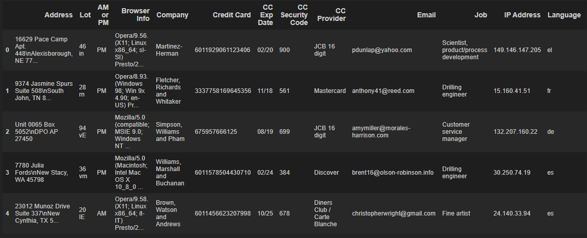

# Ecommerce Purchases Exercise


<hr>


```python
import pandas as pd
```

```python
ecom = pd.read_csv(r'filepath') #filepath depends on where you save your csv file
```


✅ Check the head of the DataFrame

<hr>

```
ecom.head()
```


